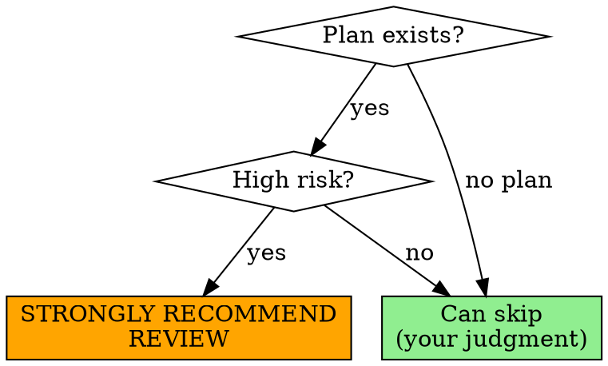

# Reviewing Plans

## Overview

Verify an implementation plan against the actual codebase before execution. Plans accumulate blind spots — wrong paths, naming drift, vague instructions, missing dependencies. A fresh-context review catches these before they cascade into execution failures.

**Core principle:** Every claim in the plan must be verified against the codebase. If you can't find 3 existing examples that confirm a convention, the plan is probably wrong.

**Announce at start:** "I'm using the reviewing-plans skill to review this plan before execution."

**Input:** Plan file path (e.g., `docs/plans/feature-name/2025-02-10-plan.md`)

## When to Use

**Strongly recommended** before executing implementation plans, especially for complex or high-risk changes.



**Consider skipping review for:**
- Simple 1-2 task changes with exact file paths (e.g., "add method X to existing file Y")
- Single file modifications with no new abstractions
- Configuration updates with clear values
- You wrote the plan in this session AND personally verified all paths/conventions
- Plan has already been reviewed and approved in previous iteration

**STRONGLY recommend review for:**
- Plans with 5+ files or 3+ tasks
- Cross-cutting changes (multiple modules/layers)
- Changes to core abstractions or data models
- Plans written by different sessions (blind spot risk)
- First-time implementation of new patterns

## Fresh Context

**Strongly recommended:** Run this in a new session, not the one that wrote the plan. Plan writers share blind spots with their context — assumptions feel "obvious" because they were obvious during writing.

If reviewing in the same session: acknowledge that you share the plan writer's blind spots and compensate by being extra rigorous with the 3-example rule.

## The Process

### Step 1: Read and Understand the Plan

Read the plan document. Also check for a design doc in the same project folder (e.g., `YYYY-MM-DD-design.md`). If one exists, use it as a reference when assessing completeness — the plan should cover what the design specifies.

Identify:
- What feature/change is being implemented
- What files, services, components are being created or modified
- What existing code the plan references or extends

### Step 2: Verify Against Codebase

**This is the critical step.** Do NOT review the plan in isolation.

#### The 3-Example Rule

For every naming convention, file path pattern, or structural claim in the plan, find **3+ existing examples** in the codebase that confirm or contradict it. If you can't find 3 confirming examples, flag it.

```
Plan says: Create `src/services/UserAuth.service.ts`
You check: What are 3 existing service files named?
You find:  user.service.ts, payment.service.ts, notification.service.ts
Verdict:   FAIL — should be `user-auth.service.ts` (kebab-case, no PascalCase)
```

**Verify:**

- **File paths**: Do referenced files actually exist? Are new files placed in directories that follow existing structure?
- **Naming patterns**: Check 3+ existing examples of the same type and confirm the plan matches
- **Naming forms**: Gerund vs noun, PascalCase vs kebab-case, singular vs plural — what does the codebase actually use?
- **Existing abstractions**: Is the plan creating something that already exists? Duplicating logic that lives elsewhere?
- **Import paths and module structure**: Correct for the framework and project layout?
- **Data patterns**: Do proposed structures (tables, schemas, types) follow existing conventions?
- **Referenced code**: Do files, functions, classes, and methods mentioned in the plan actually exist?

### Step 3: Assess Review Dimensions

#### 1. Pattern Alignment (CRITICAL)

The #1 cause of subagent execution failures.

- Do file paths match the actual project structure?
- Do entity names follow existing conventions? (3-example rule)
- Are naming forms consistent with the codebase? (e.g., if all skills use gerund form like `writing-plans`, `executing-plans`, don't name yours `plan-review`)
- Do API routes, component paths, module registrations match existing patterns?
- Does the plan reference files/functions that actually exist at those paths?
- If the plan creates config/metadata (frontmatter, package.json, manifests): does it use only supported fields? Does the format match 3+ existing examples?
- If the plan creates documentation: does the description/summary follow project conventions? (e.g., starts with "Use when", avoids summarizing workflow)

#### 2. Task Atomicity & Boundaries

Each task will be executed by an independent subagent.

- Can each task be completed without knowledge of another task's implementation details?
- Are inter-task dependencies explicitly declared?
- Is any task too large? Split if it touches 3+ unrelated files or mixes unrelated concerns:
  ```
  ❌ Task 3: "Update README, update config, update docs skill"
     → 3 unrelated files, 3 different concerns — subagent will rush or miss one
  ✅ Task 3a: "Update README skills section"
  ✅ Task 3b: "Update config registration"
  ✅ Task 3c: "Add cross-reference in docs skill"
  ```
- Is any task too small? (Grouping related operations is fine)
- Does each task have a clear, runnable verification step?

#### 3. Step Granularity

Each step within a task should be one action.

- "Write the failing test" — one step
- "Run it to verify it fails" — one step
- "Implement the minimal code" — one step
- Are any steps combining multiple unrelated actions?
- Can each step be executed without judgment calls?

#### 4. Dependency & Ordering

- Are task dependencies explicitly declared? (e.g., "depends on Task 1 completing")
- Would executing tasks out of order break things?
- Are schema/migration changes ordered before code that depends on them?
- Are there undeclared assumptions about what prior tasks create?

#### 5. Execution Risk

What's likely to break during automated execution?

- **Ambiguous instructions**: Would a subagent need to make a judgment call? (e.g., "update the relevant files" — which ones?)
- **Missing context**: Does a task reference something without specifying where it comes from?
- **Implicit assumptions**: Does the plan assume something exists that isn't stated?
- **Vague modifications**: "Add validation" instead of exact code
- **Missing verification**: Can the subagent confirm each task is actually done?
- **Platform compatibility**: Do scripts, commands, and paths work on the target platform? (e.g., bash scripts on Windows, path separators, shebangs matching existing scripts)

#### 6. Completeness

- Are there obvious gaps? (e.g., backend endpoint but no frontend, or vice versa)
- Does the plan follow TDD structure? (test-first for each implementation task)
- Is there a final verification task?
- Are error states considered where appropriate?
- **Structural completeness**: Does the proposed artifact have all expected sections for its type? Check 3+ existing examples of the same type and compare section structure. (e.g., if creating a skill, does it have Overview, When to Use, Common Mistakes? If creating a service, does it have error handling, tests?)
- Are code samples in the plan correctly formatted? (e.g., frontmatter should be raw YAML, not wrapped in markdown code fences)

### Step 4: Produce Review Report

Use the output format below. Save to the same project folder alongside the plan.

### Step 5: Present Resolution Options

Based on the verdict:

**APPROVED:** Proceed to execution. No changes needed.

**APPROVED WITH CHANGES** (fixable issues):
> "I found [N] issues. I can make surgical updates to the existing plan. Shall I apply them?"

If approved: make targeted edits to the plan file. Show a summary of changes made.

**NEEDS REVISION** (structural issues):
> "I found [N] significant issues requiring restructuring. I can create a revised version. Shall I create `[plan-name]-v2.md`?"

If approved: create new versioned plan preserving the original. Save as `docs/plans/<project>/YYYY-MM-DD-plan-v2.md` (same project folder as the original).

**In either case:** Let the user choose which approach they prefer. Don't assume.

## Output Format

```
## Plan Review: [Plan Name]

**Reviewed**: [filename]
**Verdict**: [APPROVED | APPROVED WITH CHANGES | NEEDS REVISION]

---

### Dimension Scores

| Dimension | Rating | Issues |
|-----------|--------|--------|
| Pattern Alignment | PASS/WARN/FAIL | [count] |
| Task Atomicity | PASS/WARN/FAIL | [count] |
| Step Granularity | PASS/WARN/FAIL | [count] |
| Dependency & Ordering | PASS/WARN/FAIL | [count] |
| Execution Risk | PASS/WARN/FAIL | [count] |
| Completeness | PASS/WARN/FAIL | [count] |

---

### Findings

#### [FAIL/WARN] [Dimension]: [Short description]

**Location**: Task X / Step Y
**Issue**: [What's wrong]
**Evidence**: [What you found in the codebase that contradicts the plan]
**Recommendation**: [Specific fix]

---

### Summary of Recommendations

1. [Actionable change 1]
2. [Actionable change 2]
...
```

**Save report to:** `docs/plans/<project>/YYYY-MM-DD-review.md` — same project folder as the plan being reviewed. Do NOT save directly to `docs/plans/`.

## Rules

- **Be specific**: Don't say "naming is inconsistent". Say "The plan uses `FooService` but existing services use `FooBarService` pattern (see `src/modules/foo/foo-bar.service.ts`)."
- **Cite evidence**: Every finding must reference actual files or patterns you found in the codebase.
- **3-example rule**: Convention claims need 3+ confirming examples. No exceptions.
- **Prioritize execution failures**: Issues causing subagents to produce wrong code outrank style preferences.
- **Don't nitpick**: If the plan is functionally correct and follows patterns, don't invent issues. A clean APPROVED is a valid outcome.
- **Consider the audience**: Plans are executed by AI subagents. Flag ambiguity, not things requiring human judgment.

## Integration

**Upstream:** `writing-plans` creates the plan this skill reviews.

**Downstream:** `executing-plans` or `subagent-driven-development` executes the reviewed plan.

**This skill is optional.** It slots between plan creation and execution for complex or high-risk plans. Simple plans can skip directly to execution.
